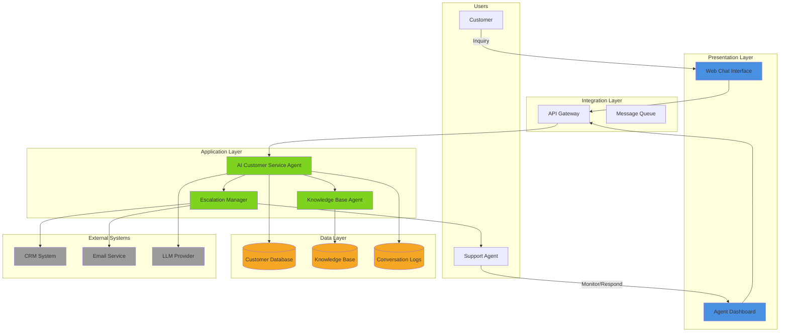
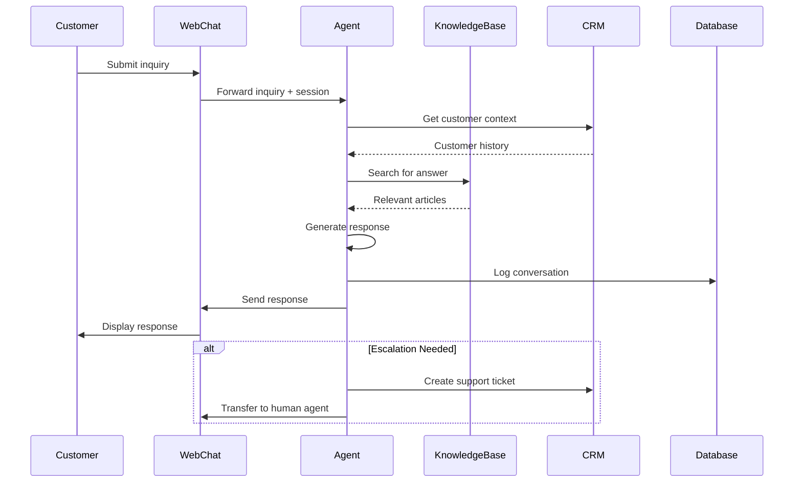

# Solution Architecture Documentation

## Purpose
This skill defines the process for analyzing business requirements, use cases, or problem statements and generating **three separate Solution Architecture Documents** that bridge business needs with technical implementation. These documents are designed to be:
- Understandable by business stakeholders and executives
- Sufficiently detailed for technical teams to elaborate further
- Ready for decomposition into detailed SOPs using the sop-builder skill
- Focused on the "what" and "why" before the "how"
- Modular and manageable in size

## Objective
Transform business requirements into **three focused Solution Architecture Documents**:

1. **Solution Overview Document** - Business-focused summary and context
2. **Solution Architecture Document** - Technical architecture and design
3. **Implementation Plan Document** - Roadmap and SOP breakdown

Each document:
- Clearly articulates specific aspects of the solution
- Avoids repetition across documents through cross-references
- Provides appropriate level of detail for its audience
- Can be read independently or as part of the complete set

---

## Scope
This procedure applies to:
- Business requirement documents (BRDs)
- Use case descriptions
- Problem statements
- RFPs and project proposals
- Business process improvement initiatives
- Digital transformation projects
- System modernization efforts

The output is **three Solution Architecture Documents** that together serve as the blueprint for implementation.

---

## Documentation Principles

**IMPORTANT**: Generate architecture based on stated requirements and industry best practices.

**Rules:**
- Focus on business value and outcomes
- Use clear, jargon-free language for business sections
- Keep descriptions concise and avoid repetition across sections
- Reference other documents/sections instead of duplicating information
- Provide high-level technical detail, not implementation specifics
- Only include information explicitly mentioned in the BRD or necessary for understanding
- Document assumptions and constraints only if stated in BRD
- Ensure traceability from requirements to components
- Design for scalability, security, and maintainability at a high level

**Excluded from this assessment** (will be required for final solution planning):
- Detailed FTE resource requirements and team composition
- Comprehensive risk assessment and mitigation strategies
- Performance metrics and KPIs beyond basic NFRs
- Detailed budget and cost estimates
- Future enhancements and speculative features not in the BRD

---

## Procedure

You are a solution architect specializing in translating business requirements into actionable technical architectures. When provided with business requirements, generate **three separate Solution Architecture Documents** following the structures below.

### Iterative Review Process

**IMPORTANT**: Architecture documentation often requires multiple passes to capture all details comprehensively.

After generating the initial documents:
1. **Review the output** - Check that all three documents are complete with all required sections
2. **Identify gaps** - Look for missing sections, incomplete details, or areas that need expansion
3. **Re-run if needed** - If sections are missing or incomplete, re-run the skill with specific instructions like:
   - "Complete the missing [section name] in the [document name]"
   - "Expand the [component/section] with more detail"
   - "Add missing [diagrams/tables/details] to [document name]"

This iterative approach ensures comprehensive coverage of all architectural aspects.

---

# DOCUMENT 1: Solution Overview

## File Naming Convention
`[solution-name]-overview.md`

Example: `customer-service-automation-overview.md`

## Document Purpose
Business-focused document for executives and stakeholders. Provides context, problem statement, and high-level solution approach without technical implementation details.

## Document Header
```markdown
# [Solution Name] - Solution Overview

**Document Type**: Solution Overview
**Version**: 1.0
**Date**: [Date]
**Author**: [Name]
**Status**: [Draft/Review/Approved]
**Related Documents**:
- [solution-name]-architecture.md (Technical Architecture)
- [solution-name]-implementation.md (Implementation Plan)

---
```

## Document Structure

### 1. Executive Summary

Provide a concise overview for executives and decision-makers:

- **Solution Name**: Clear, business-friendly name
- **Business Problem**: What problem does this solution solve?
- **Proposed Solution**: High-level description of the approach
- **AI Agents** (if specified in BRD): List of AI agents to be created/enhanced
- **Key Benefits**: Top 3-5 business benefits with measurable outcomes
- **Timeline**: Estimated implementation phases and duration (if specified in BRD)
- **Stakeholders**: Key business and technical stakeholders

**Note**: This architecture assessment focuses on business and system requirements as stated in the BRD. The following elements are not included in this assessment but will be required for final solution planning:
- Detailed FTE resource requirements and team composition
- Comprehensive risk assessment and mitigation strategies
- Performance metrics and KPIs beyond basic NFRs
- Detailed budget and cost estimates

**Example:**
```
Solution Name: Intelligent Customer Service Automation

Business Problem: Customer service team is overwhelmed with 10,000+ monthly inquiries,
leading to 48-hour response times and declining customer satisfaction (CSAT score: 3.2/5).

Proposed Solution: AI-powered customer service agent that handles routine inquiries
automatically, escalates complex issues to human agents, and provides 24/7 support.

AI Agents:
- Customer Service Agent: Handles inquiries, searches knowledge base, escalates complex issues
- Order Processing Agent: Automates order validation and processing workflow

Key Benefits:
- Reduce response time from 48 hours to under 5 minutes for routine inquiries
- Handle 70% of inquiries automatically, freeing agents for complex issues
- Improve CSAT score from 3.2 to 4.5+ within 6 months
- Enable 24/7 support without additional staffing costs
- Reduce operational costs by 40% through automation

Timeline: 4-6 months (design, build, test, deploy) - if specified in BRD
```

---

### 2. Business Context

#### 2.1 Problem Statement
Describe the business problem in detail:
- **Current Situation**: What exists today?
- **Pain Points**: What specific problems are experienced?
- **Business Impact**: How does this affect the organization?
  - Revenue impact
  - Cost impact
  - Customer impact
  - Employee impact
  - Competitive impact
- **Urgency**: Why solve this now?
- **Scope of Impact**: Who and what is affected?

#### 2.2 AI Agents and Automation Requirements

**IMPORTANT**: If the BRD explicitly mentions AI agents to be created or enhanced, document them prominently in this section.

For each AI agent specified in the requirements:

**Agent [Number]: [Agent Name]**
- **Purpose**: What business function this agent performs
- **Capabilities**: Key capabilities the agent must have
- **Scope**: What the agent handles vs. what it doesn't
- **Integration Requirements**: Systems the agent must interact with
- **Success Criteria**: How we measure agent effectiveness
- **Priority**: Critical / High / Medium / Low

**Example:**
```
Agent 1: Customer Service Agent
- Purpose: Automatically handle customer inquiries and provide instant support
- Capabilities:
  - Understand natural language questions
  - Search knowledge base for answers
  - Provide personalized responses based on customer history
  - Escalate complex issues to human agents
  - Learn from interactions to improve over time
- Scope:
  - In Scope: Product questions, order status, basic troubleshooting, FAQs
  - Out of Scope: Refunds/returns (requires human approval), complex technical issues
- Integration Requirements: CRM system, knowledge base, order management system
- Success Criteria: 70% automation rate, <5 second response time, 4.5+ CSAT
- Priority: Critical
```

**Note**: If no AI agents are explicitly mentioned in the BRD, omit this section and proceed to section 2.3.

#### 2.3 Business Requirements
Document the key business requirements:

**Requirement [Number]: [Requirement Name]**
- **Description**: What is needed
- **Business Justification**: Why it's needed
- **Priority**: Critical / High / Medium / Low
- **Success Criteria**: How we know it's met
- **Stakeholder**: Who needs this

**Example:**
```
Requirement 1: 24/7 Customer Support Availability
- Description: Customers must be able to get support at any time, including nights,
  weekends, and holidays
- Business Justification: 35% of inquiries come outside business hours; competitors
  offer 24/7 support; losing customers to competitors
- Priority: High
- Success Criteria: System responds to inquiries within 2 minutes, 24/7/365
- Stakeholder: VP of Customer Experience
```

#### 2.4 Business Constraints

**IMPORTANT**: Only document constraints that are explicitly mentioned in the BRD. Do not speculate or add constraints that are not stated.

Document constraints that limit the solution (if specified in BRD):
- **Budget Constraints**: Financial limitations (if mentioned)
- **Timeline Constraints**: Deadline requirements (if mentioned)
- **Resource Constraints**: People, skills, availability (if mentioned)
- **Technical Constraints**: Existing systems, platforms, standards (if mentioned)
- **Regulatory Constraints**: Compliance requirements (if mentioned)
- **Organizational Constraints**: Policies, processes, culture (if mentioned)

**Note**: If no constraints are mentioned in the BRD, state "No specific constraints mentioned in the BRD" and proceed to the next section.

---

### 3. Solution Overview

#### 3.1 Solution Vision
Describe the future state after implementation:
- What will be different?
- How will users interact with the solution?
- What new capabilities will exist?
- What processes will change?

#### 3.2 Solution Approach
Explain the high-level approach:
- **Architecture Pattern**: (e.g., microservices, event-driven, agent-based)
- **Technology Strategy**: Build vs. buy decisions
- **Integration Strategy**: How components connect
- **Deployment Strategy**: Cloud, on-premise, hybrid
- **Data Strategy**: How data flows and is stored

#### 3.3 Key Capabilities
List the major capabilities the solution provides:

**Capability [Number]: [Capability Name]**
- **Description**: What this capability does
- **Business Value**: Why it matters
- **User Benefit**: How users benefit
- **Technical Approach**: High-level implementation approach

---

# DOCUMENT 2: Solution Architecture

## File Naming Convention
`[solution-name]-architecture.md`

Example: `customer-service-automation-architecture.md`

## Document Purpose
Technical architecture document for architects, developers, and technical stakeholders. Provides detailed component design, integration patterns, data architecture, and security approach.

## Document Header
```markdown
# [Solution Name] - Solution Architecture

**Document Type**: Solution Architecture
**Version**: 1.0
**Date**: [Date]
**Author**: [Name]
**Status**: [Draft/Review/Approved]
**Related Documents**:
- [solution-name]-overview.md (Business Overview)
- [solution-name]-implementation.md (Implementation Plan)

---
```

## Document Structure

### 1. Architecture Overview

Brief summary linking to the business context:
- Reference the Solution Overview document for business context
- Summarize the technical approach in 2-3 paragraphs
- Highlight key architectural decisions

---

### 2. Solution Architecture Diagram

Create a high-level architecture diagram using Mermaid:

**IMPORTANT**:
- Keep diagrams at a HIGH LEVEL - show major components only, not subcomponents or internal details
- Focus on the main system boundaries and key integration points
- Avoid showing internal implementation details or breaking components into subcomponents
- The diagram should be simple enough to fit on one page and be easily understood by business stakeholders

**Requirements**:
- Show major system components as boxes (5-10 components maximum)
- Show external systems and integrations
- Show data flows with labeled arrows (key flows only)
- Show users/actors interacting with the system
- Use color coding for different component types:
  - User interfaces (blue)
  - Business logic/agents (green)
  - Data storage (orange)
  - External systems (gray)
  - Security components (red)
- Include a legend explaining symbols and colors

**IMPORTANT - Mermaid Reserved Keywords**:
- Avoid using these reserved keywords as participant/component names in sequence diagrams: `Note`, `participant`, `actor`, `loop`, `alt`, `opt`, `par`, `and`, `rect`, `end`, `activate`, `deactivate`, `autonumber`
- If you need to reference these concepts, use alternative names (e.g., use "NotesService" instead of "Note", "RecordingService" instead of "Recording")

**Example Structure**:


**Legend**:
- Blue boxes: User-facing interfaces
- Green boxes: AI agents and business logic
- Orange cylinders: Data storage
- Gray boxes: External systems
- Arrows: Data/control flow

---

### 3. Component Breakdown

**IMPORTANT**: Keep component descriptions concise. Avoid repeating information already covered in other sections. Reference other sections instead of duplicating details.

For each major component in the architecture:

#### Component [Number]: [Component Name]

**Purpose**: What this component does in business terms (1-2 sentences)

**Key Responsibilities**: List 3-5 main responsibilities

**Inputs/Outputs**: Brief summary of key data flows (reference Integration Architecture section for details)

**Key Technologies** (if known): Primary technology/platform only

**Dependencies**: Critical dependencies only (reference Integration Architecture section for details)

**Example:**
```
Component 1: AI Customer Service Agent

Purpose: Automatically handles customer inquiries by understanding questions and providing accurate responses in natural language.

Key Responsibilities:
- Interpret customer inquiries in natural language
- Route inquiries to appropriate knowledge sources
- Generate contextually appropriate responses
- Detect when human escalation is needed
- Log interactions for quality tracking

Inputs/Outputs: Receives customer inquiries from Web Chat Interface; outputs responses and escalation requests (see Integration Architecture for details)

Key Technologies: watsonx Orchestrate, Large Language Model

Dependencies: LLM Provider, Knowledge Base, Customer Database (see Integration Architecture for details)
```

---

### 4. Integration Architecture

**IMPORTANT**: Keep integration architecture high-level. Focus on what systems integrate and why, not detailed implementation specifics.

#### 4.1 Integration Points

For each external system integration:

**Integration [Number]: [System Name]**

**Purpose**: Why we integrate with this system

**Integration Type**: (e.g., Real-time API, Batch data exchange, Event-driven messaging)

**Data Exchanged**:
- **To External System**: What we send
- **From External System**: What we receive

**Integration Pattern**: (e.g., Request/Response, Publish/Subscribe, Webhook)

**Security**: High-level authentication approach (e.g., OAuth 2.0, API keys)

**Example:**
```
Integration 1: CRM System

Purpose: Retrieve customer history and update customer records with support interactions

Integration Type: Real-time API calls

Data Exchanged:
- To CRM: Support ticket details, resolution status, customer satisfaction scores
- From CRM: Customer profile, purchase history, previous support tickets, account status

Integration Pattern: Request/Response (REST API)

Security: OAuth 2.0 authentication with API keys
```

#### 4.2 Data Flow Diagram

Create a high-level data flow diagram showing how information moves through the system:



---

### 5. Data Architecture

**IMPORTANT**: Keep data architecture high-level. Focus on key data entities and storage approach, not detailed schemas.

#### 5.1 Data Entities

For each major data entity:

**Entity [Number]: [Entity Name]**

**Description**: What this data represents

**Key Attributes**: List 3-5 most important attributes with data types

**Data Source**: Where this data originates

**Privacy Classification**: Public / Internal / Confidential / Restricted

**Example:**
```
Entity 1: Customer Inquiry

Description: A customer's question or request for support

Key Attributes:
- inquiry_id: Unique identifier (UUID)
- customer_id: Customer identifier
- inquiry_text: Customer's question (text)
- inquiry_type: Category (billing/technical/general)
- status: Current state (new/in-progress/resolved/escalated)

Data Source: Customer via web chat interface

Privacy Classification: Confidential (contains customer PII)
```

#### 5.2 Data Storage Strategy

**Primary Data Store**:
- **Type**: (e.g., Relational database, Document store, Vector database)
- **Purpose**: What data is stored here
- **Rationale**: Why this storage type

**Secondary Data Stores** (if applicable):
- Cache layer for performance
- Archive storage for compliance
- Analytics data warehouse

---

### 6. Security Architecture

**IMPORTANT**: Keep security architecture high-level. Focus on key security requirements and approaches, not detailed implementation.

#### 6.1 Security Requirements

**Authentication**:
- High-level authentication approach (e.g., SSO, MFA, API keys)

**Authorization**:
- Access control approach (e.g., Role-based access control)

**Data Protection**:
- Encryption approach (at rest and in transit)
- PII handling requirements

**Compliance**:
- Regulatory requirements (if specified in BRD, e.g., GDPR, HIPAA, SOC 2)

#### 6.2 Key Security Controls

List 3-5 most important security controls:

**Control [Number]: [Control Name]**
- **Purpose**: What threat it mitigates
- **Implementation**: High-level approach

**Example:**
```
Control 1: API Rate Limiting
- Purpose: Prevent denial-of-service attacks and abuse
- Implementation: API gateway enforces rate limits per API key

Control 2: Data Encryption
- Purpose: Protect sensitive customer data from unauthorized access
- Implementation: Encryption at rest and in transit using industry standards

Control 3: Multi-Factor Authentication
- Purpose: Prevent unauthorized access to agent dashboard
- Implementation: MFA for all agent logins
```

---

### 7. Non-Functional Requirements

#### 7.1 Performance Requirements

**Response Time**:
- User-facing operations: Target response times
- Background processes: Acceptable processing times

**Throughput**:
- Transactions per second/minute/hour
- Concurrent users supported
- Data processing volume

**Example:**
```
Response Time:
- Customer inquiry response: <5 seconds (95th percentile)
- Agent dashboard load: <2 seconds
- Knowledge base search: <1 second

Throughput:
- Support 100 concurrent customer conversations
- Process 10,000 inquiries per month (growing to 50,000)
- Handle 500 knowledge base searches per hour
```

#### 7.2 Availability Requirements

**Uptime Target**: (e.g., 99.9% = ~8.7 hours downtime/year)

**Maintenance Windows**: When system can be down for updates

**Disaster Recovery**:
- Recovery Time Objective (RTO): How quickly system must be restored
- Recovery Point Objective (RPO): How much data loss is acceptable

**Example:**
```
Uptime Target: 99.5% (43.8 hours downtime/year)

Maintenance Windows: 
- Scheduled maintenance: Sundays 2-6 AM EST (monthly)
- Emergency maintenance: As needed with 2-hour notice

Disaster Recovery:
- RTO: 4 hours (system restored within 4 hours of failure)
- RPO: 15 minutes (maximum 15 minutes of data loss)
```

#### 7.3 Scalability Requirements

**Growth Projections**:
- User growth over time
- Data volume growth
- Transaction volume growth

**Scaling Strategy**:
- Horizontal vs. vertical scaling
- Auto-scaling triggers
- Capacity planning approach

**Example:**
```
Growth Projections:
- Year 1: 10,000 inquiries/month, 50 concurrent users
- Year 2: 30,000 inquiries/month, 150 concurrent users
- Year 3: 50,000 inquiries/month, 250 concurrent users

Scaling Strategy:
- Horizontal scaling of agent instances (auto-scale based on queue depth)
- Database read replicas for query performance
- CDN for static content delivery
- Quarterly capacity reviews and planning
```

---

# DOCUMENT 3: Implementation Plan

## File Naming Convention
`[solution-name]-implementation.md`

Example: `customer-service-automation-implementation.md`

## Document Purpose
Implementation planning document for project managers, technical leads, and delivery teams. Provides roadmap, assumptions, constraints, and guidance for SOP development.

## Document Header
```markdown
# [Solution Name] - Implementation Plan

**Document Type**: Implementation Plan
**Version**: 1.0
**Date**: [Date]
**Author**: [Name]
**Status**: [Draft/Review/Approved]
**Related Documents**:
- [solution-name]-overview.md (Business Overview)
- [solution-name]-architecture.md (Technical Architecture)

---
```

## Document Structure

### 1. Implementation Overview

Brief summary linking to the other documents:
- Reference the Solution Overview document for business context
- Reference the Solution Architecture document for technical details
- Summarize the implementation approach in 2-3 paragraphs

---

### 2. Implementation Roadmap

**IMPORTANT**: Only include implementation roadmap if explicitly mentioned in the BRD. If no roadmap or timeline is specified in the BRD, state "Implementation roadmap to be defined based on organizational priorities and resource availability" and proceed to the next section.

#### 2.1 Implementation Phases

Break implementation into logical phases (only if specified in BRD):

**Phase [Number]: [Phase Name]**

**Duration**: Estimated time (if provided in BRD)

**Objectives**: What will be accomplished

**Deliverables**: Key deliverables for this phase

**Dependencies**: What must be complete first

**Example:**
```
Phase 1: Foundation and Core Agent

Duration: 8 weeks (if specified in BRD)

Objectives:
- Establish development environment and infrastructure
- Build core AI agent with basic inquiry handling
- Integrate with knowledge base

Deliverables:
- Development and staging environments
- Core agent handling common inquiry types
- Basic web chat UI

Dependencies:
- LLM provider contract signed
- Development team onboarded
```

---

### 3. Assumptions and Constraints

#### 3.1 Assumptions

Document key assumptions made during architecture design:

**Assumption [Number]**: [Assumption Statement]
- **Rationale**: Why this assumption is made
- **Impact if Invalid**: What happens if assumption is wrong
- **Validation Approach**: How to verify assumption

**Example:**
```
Assumption 1: Customer inquiries follow predictable patterns
- Rationale: Analysis of historical support tickets shows 80% fall into 10 categories
- Impact if Invalid: Agent may struggle with unexpected inquiry types, requiring more 
  human escalation than planned
- Validation Approach: Analyze first month of production data to confirm pattern distribution

Assumption 2: LLM provider API will remain stable
- Rationale: Provider has documented API versioning and deprecation policy
- Impact if Invalid: May require significant rework of agent integration
- Validation Approach: Monitor provider's API changelog and participate in beta programs
```

#### 3.2 Constraints

Document constraints that limit the solution (only if specified in BRD):

**Constraint [Number]**: [Constraint Statement]
- **Type**: Technical / Business / Regulatory / Resource
- **Impact**: How this limits the solution
- **Workaround**: How to work within constraint

**Example:**
```
Constraint 1: Must integrate with existing CRM system
- Type: Technical
- Impact: Limited to CRM's API capabilities and data model
- Workaround: Build adapter layer to transform data between systems

Constraint 2: Budget limited to $200K for initial implementation
- Type: Business
- Impact: Must prioritize features and potentially phase implementation
- Workaround: Focus on MVP features first, plan enhancements for Phase 2
```

---

### 4. Next Steps and Recommendations

#### 4.1 Immediate Next Steps

List the first actions to take based on the stated requirements:

1. **Action**: What needs to happen
   - **Owner**: Who is responsible
   - **Timeline**: When it should be done
   - **Dependencies**: What's needed to start

**Example:**
```
1. Conduct detailed requirements workshop with stakeholders
   - Owner: Business Analyst
   - Timeline: Within 2 weeks
   - Dependencies: Stakeholder availability, workshop agenda prepared

2. Evaluate and select LLM provider
   - Owner: Technical Lead
   - Timeline: Within 3 weeks
   - Dependencies: Requirements finalized, budget approved

3. Set up development environment
   - Owner: DevOps Engineer
   - Timeline: Within 4 weeks
   - Dependencies: Infrastructure budget approved, cloud accounts created
```

#### 4.2 Recommendations

Provide architectural recommendations based on the stated requirements:

**Recommendation [Number]**: [Recommendation]
- **Rationale**: Why this is recommended
- **Benefits**: What will be gained
- **Considerations**: What to be aware of

**Example:**
```
Recommendation 1: Start with MVP focused on top 5 inquiry types
- Rationale: Reduces complexity and risk, enables faster time to value
- Benefits: Earlier feedback from users, lower initial investment, proven value before 
  scaling
- Considerations: Must carefully select inquiry types that provide maximum business value

Recommendation 2: Implement comprehensive logging and monitoring from day one
- Rationale: Essential for troubleshooting, optimization, and measuring success
- Benefits: Faster issue resolution, data-driven improvements, compliance support
- Considerations: Requires upfront investment in observability tools and practices
```

**Note**: This section focuses only on what is stated in the BRD. Future enhancements and speculative features are intentionally excluded from this assessment.

---

### 5. Decomposition for SOP Development

This section guides how to break down the solution architecture into detailed SOPs using the sop-builder skill.

#### 5.1 Recommended SOP Breakdown

For each major component or process in the architecture, create a separate SOP:

**SOP [Number]: [SOP Name]**
- **Scope**: What this SOP covers
- **Source Material**: Relevant architecture sections (reference the Architecture document)
- **Key Processes**: Main processes to document
- **Integration Points**: External dependencies
- **Priority**: Implementation priority (High / Medium / Low)

**Example:**
```
SOP 1: Customer Inquiry Processing
- Scope: End-to-end process from customer submits inquiry to response delivered
- Source Material:
  - Architecture Document, Component 1: AI Customer Service Agent
  - Architecture Document, Integration 1: CRM System
  - Architecture Document, Data Entity 1: Customer Inquiry
- Key Processes:
  - Receive and validate inquiry
  - Retrieve customer context
  - Search knowledge base
  - Generate response
  - Log interaction
  - Handle escalations
- Integration Points: CRM, Knowledge Base, LLM Provider
- Priority: High (core functionality)

SOP 2: Knowledge Base Management
- Scope: Process for creating, updating, and maintaining knowledge base articles
- Source Material:
  - Architecture Document, Component 3: Knowledge Base Agent
  - Architecture Document, Data Entity 2: Knowledge Article
- Key Processes:
  - Create new article
  - Review and approve article
  - Update existing article
  - Retire outdated article
  - Monitor article effectiveness
- Integration Points: Content management system, Analytics
- Priority: High (required for agent accuracy)
```

#### 5.2 Mapping Architecture to SOPs

**For each SOP to be created:**

1. **Identify the business process**: What workflow needs documentation?
2. **Extract relevant components**: Which architecture components are involved? (reference Architecture document)
3. **Map data flows**: How does data move through the process? (reference Architecture document)
4. **Document decision points**: What choices are made and how?
5. **Define integration points**: What external systems are involved? (reference Architecture document)
6. **Specify business rules**: What rules govern the process?
7. **Detail exception handling**: What happens when things go wrong?

**Use the sop-builder skill** to transform each identified process into a detailed SOP by providing:
- The relevant architecture sections from the Architecture document
- The specific process to document
- Any additional business context
- Integration and data flow details

---

## Usage Instructions

### To Use This Skill:

1. **Provide Requirements**: Share business requirements, use cases, or problem statements
2. **Specify Context**: Provide organizational context, constraints, and priorities
3. **Review Documents**: Validate the three proposed solution documents
4. **Iterate**: Refine based on feedback and additional details
5. **Approve**: Get stakeholder sign-off on all three documents
6. **Decompose**: Use sop-builder skill to create detailed SOPs for each component

### Example Request:

```
Please create solution architecture documents for the following business requirement:

@customer-service-requirements.docx

Additional context:
- Company: E-commerce retailer with 500K customers
- Current state: 10-person support team, 48-hour response time
- Budget: $150K-$200K for initial implementation (if mentioned in BRD)
- Timeline: Must launch within 6 months (if mentioned in BRD)
- Key constraint: Must integrate with existing Salesforce CRM
- Priority: Improve customer satisfaction and reduce operational costs
```

### Output:

The skill will generate **three separate markdown files**:
1. `[solution-name]-overview.md` - Business overview and context
2. `[solution-name]-architecture.md` - Technical architecture and design
3. `[solution-name]-implementation.md` - Implementation plan and SOP breakdown

---

## Quality Standards

### Completeness
- All sections addressed with appropriate detail
- Clear traceability from requirements to components
- All integration points identified
- Focus on requirements stated in the BRD

### Clarity
- Business sections understandable by non-technical stakeholders
- Technical sections provide sufficient detail for implementation
- Diagrams clearly illustrate architecture and data flows
- Examples provided where helpful

### Feasibility
- Solution is technically achievable
- Timeline is achievable (if specified)
- Constraints are manageable

### Business Alignment
- Solution addresses stated business problems
- Benefits are measurable and achievable
- Success criteria are clear

---

## Provide Your Requirements Below:

**Business Requirements**:
```
@your-requirements-file  # Replace with your BRD, use case, or problem statement
```

**Additional Context** (optional but recommended):
```
- Organization type and size:
- Current state/pain points:
- Budget constraints (if any):
- Timeline requirements (if any):
- Technical constraints (if any):
- Regulatory requirements (if any):
- Key stakeholders:
- Success criteria:
```

---
