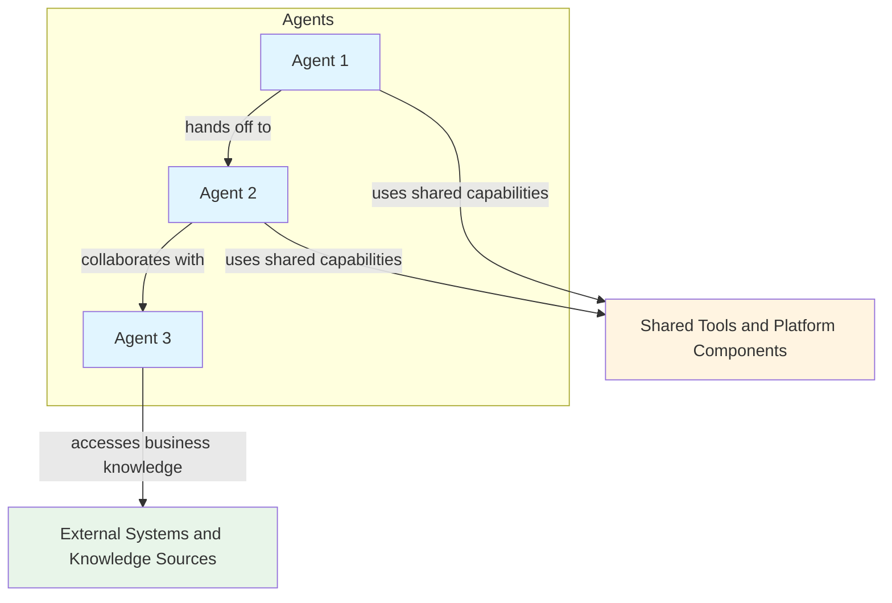
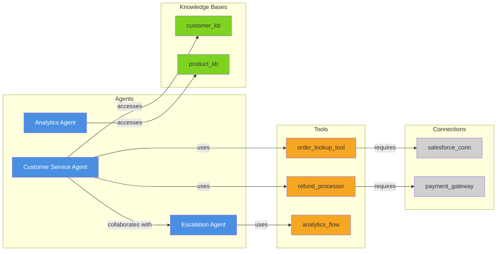

# watsonx Orchestrate (wxO) Project Analyzer

## Purpose

This skill analyzes watsonx Orchestrate projects to generate a 3-file documentation set that includes:
- **Solution Overview Report**: The overall business purpose, architecture, project structure, deployment notes, and high-level relationships
- **Agent Analysis Report**: Purpose, configuration, instructions summary, and capabilities of each agent
- **Tools and Components Report**: Python tools, flow tools, Langflow tools, connections, knowledge bases, and their relationships
- **Relationship Mapping**: Mermaid diagrams showing how agents, tools, connections, and knowledge bases interact across the three reports
- **Project Structure**: Overview of the project organization and component inventory

## Objective

Transform a watsonx Orchestrate project directory into a clear 3-report documentation set that helps stakeholders understand:
- The overall architecture and design of the solution
- What agents exist and what they do
- What tools and other components are available and how they work
- How components are connected and depend on each other

---

## Scope

This analyzer works with watsonx Orchestrate projects that follow the standard ADK structure:

```
project_directory/
├── agents/                    # Agent YAML configurations
│   ├── agent1.yaml
│   └── agent2.yaml
├── tools/                     # Python tools and flows
│   ├── tool1.py
│   ├── flow1.py
│   └── langflow_tool.json
├── connections/               # Connection configurations (optional)
│   └── connection1.yaml
├── knowledge_bases/           # Knowledge base configs (optional)
│   └── kb1.yaml
├── main_flow.py              # Main flow orchestration (optional)
├── import-all.sh             # Import script
└── README.md                 # Project documentation
```

---

## Analysis Process

### Step 1: Directory Discovery

When the user provides a directory path, analyze the structure:

1. **Identify Project Type**:
   - Check for `agents/` directory (agent-based project)
   - Check for `tools/` directory (tool-based project)
   - Check for `main_flow.py` (flow-based project)
   - Check for `connections/` directory (connection configurations)

2. **Scan for Components**:
   - Count and list all YAML files in `agents/`
   - Count and list all Python files in `tools/`
   - Count and list all JSON files in `tools/` (Langflow)
   - Count and list all YAML files in `connections/`
   - Count and list all YAML files in `knowledge_bases/`
   - Count key root-level project files such as `main_flow.py`, `import-all.sh`, `README.md`, and other implementation-relevant files present in the project root
   - Make sure the reported totals reconcile with the actual files discovered in the project structure

### Step 2: Component Analysis

For each component type, extract detailed information:

#### Agent Analysis (from YAML files)

Extract from each agent YAML file:
- **Name**: Agent identifier
- **Kind**: native, external, or assistant
- **Description**: What the agent does
- **Instructions**: Detailed behavior guidance
- **LLM Model**: Which model it uses
- **Tools**: List of tools the agent can use
- **Collaborators**: Other agents it can call
- **Knowledge Bases**: Knowledge bases it accesses
- **Configuration**: Special settings (hidden, enable_cot, etc.)

**Example Agent YAML Structure**:
```yaml
spec_version: v1
kind: native
name: customer_service_agent
description: Handles customer inquiries and support requests
instructions: |
  You are a customer service agent...
llm: groq/openai/gpt-oss-120b
tools:
  - order_lookup_tool
  - refund_processor
collaborators:
  - escalation_agent
knowledge_base:
  - customer_kb
config:
  hidden: false
  enable_cot: true
```

#### Python Tool Analysis (from .py files)

Extract from each Python tool file:
- **Tool Name**: Function name with `@tool` decorator
- **Description**: From docstring
- **Purpose**: What the tool does
- **Parameters**: Input parameters and types
- **Return Type**: What it returns
- **Dependencies**: External libraries or APIs used
- **Credentials**: Expected credentials (from `expect_credentials`)

**Example Python Tool Pattern**:
```python
from ibm_watsonx_orchestrate.flow_builder import tool

@tool
def order_lookup_tool(order_id: str) -> dict:
    """
    Looks up order details by order ID.
    
    Args:
        order_id: The unique order identifier
        
    Returns:
        Order details including status, items, and shipping info
    """
    # Implementation
    pass
```

#### Flow Tool Analysis (from .py or .json files)

**Priority Rule**: Analyze Python (.py) files with `@flow` decorator first. Only analyze JSON format flows if there is no equivalent Python implementation with the same name.

**From Python Flow Files (.py with @flow decorator)**:
- **Flow Name**: Function name with `@flow` decorator
- **Description**: From docstring
- **Purpose**: What the flow orchestrates
- **Steps**: Sequence of operations
- **Nodes**: Individual processing steps
- **Data Flow**: How data moves through the flow

**Example Python Flow Pattern**:
```python
from ibm_watsonx_orchestrate.flow_builder import flow, Node

@flow
def document_processing_flow(document: str) -> dict:
    """
    Processes documents through extraction and validation.
    """
    # Flow implementation with nodes
    pass
```

**From JSON Flow Files (.json agentic workflow format)**:
- **Flow Name**: From file name or metadata
- **Description**: Flow purpose and orchestration logic
- **Nodes**: Processing steps and their configuration
- **Edges**: Connections and data flow between nodes
- **Tools**: Tools invoked within the flow
- **Conditional Logic**: Branching and decision points

**Example JSON Flow Pattern**:
```json
{
  "name": "Book_a_flight_flow",
  "description": "Orchestrates flight booking process",
  "nodes": [
    {
      "id": "search_flights",
      "type": "tool",
      "tool": "flight_search_tool"
    },
    {
      "id": "book_flight",
      "type": "tool",
      "tool": "flight_booking_tool"
    }
  ],
  "edges": [
    {
      "source": "search_flights",
      "target": "book_flight"
    }
  ]
}
```

**Analysis Priority**:
1. Check for Python (.py) implementation first
2. If Python exists, use it as the primary source
3. If only JSON exists, analyze the JSON format
4. If both exist with the same name, prefer Python and note JSON as alternative format

#### Langflow Tool Analysis (from .json files)

**IMPORTANT DISTINCTION**: Langflow and Agentic Workflow are different:
- **Langflow**: Third-party visual workflow builder with its own JSON format (nodes, edges, components)
- **Agentic Workflow**: watsonx Orchestrate native workflow format with `spec.kind: "flow"` in JSON

**For Langflow JSON files** (if present):
Extract from Langflow JSON files:
- **Flow Name**: From metadata
- **Description**: Flow purpose
- **Nodes**: Components in the flow
- **Edges**: Connections between nodes
- **Input/Output**: Entry and exit points
- **Note in report**: Clearly label as "Langflow workflows" to distinguish from native Agentic workflows

**For Agentic Workflow JSON files** (watsonx Orchestrate native):
- Look for `spec.kind: "flow"` in JSON structure
- Extract flow name, description, input schema, initiators
- Document as "Agentic workflow" (not Langflow)
- These are the native watsonx Orchestrate workflow format

#### Connection Analysis (from YAML files)

Extract from connection YAML files:
- **App ID**: Connection identifier
- **Kind**: Connection type (basic, bearer, api_key, oauth, key_value)
- **Description**: What system it connects to
- **Configuration**: Environment settings (draft/live)
- **Usage**: Which tools/agents use this connection

**Example Connection YAML Structure**:
```yaml
spec_version: v1
app_id: salesforce_connection
kind: oauth_auth_client_credentials_flow
description: Connection to Salesforce API
environments:
  draft:
    type: team
    server_url: https://api.salesforce.com
```

### Step 3: Relationship Mapping

Build a relationship graph showing:
- **Agent → Tool**: Which agents use which tools
- **Agent → Agent**: Which agents collaborate with other agents
- **Agent → Knowledge Base**: Which agents access which knowledge bases
- **Tool → Connection**: Which tools require which connections
- **Tool → Tool**: Dependencies between tools (if any)

### Step 4: Organize Findings into the 3-File Format

The primary output of this skill is a 3-file documentation set:

1. **Solution Overview Report**
   - Focus on the business purpose, overall architecture, project structure, deployment, and summary relationships
   - Intended audience: stakeholders, architects, new team members, and delivery leads

2. **Agent Analysis Report**
   - Focus on agent-by-agent analysis including role, instructions summary, configuration, collaborators, tools used, and knowledge base access
   - Intended audience: prompt authors, AI engineers, and maintainers of agent behavior

3. **Tools and Components Report**
   - Focus on tools and supporting components including Python tools, flows, Langflow assets, connections, and knowledge bases
   - Intended audience: developers, integrators, and platform engineers

In the solution overview report, keep the architecture intentionally high level:
- Show only major agent-to-agent relationships and overall solution structure
- Do not include detailed per-agent configuration, instructions, or capability breakdowns
- Reserve detailed agent analysis for the dedicated agent analysis report

Use cross-references between the three reports when helpful so readers can move from high-level architecture to agent details and then to tool/component implementation details.

---

## 3-File Report Structure

Generate three markdown reports instead of one combined report.

### File 1: Solution Overview Report

This file should give readers the fastest possible understanding of the overall solution before they read the deeper reports.

#### 1. Executive Summary

```markdown
# watsonx Orchestrate Solution Overview

**Project Directory**: [path]
**Analysis Date**: [date]
**Generated By**: wxo-analyzer skill

## Summary Statistics
- **Total Agents**: [count]
- **Total Tools**: [count]
  - Python Tools: [count]
  - Flow Tools: [count]
  - Langflow Tools: [count]
- **Total Connections**: [count]
- **Total Knowledge Bases**: [count]
- **Other Key Files**: [count]
- **Total Counted Project Files in Scope**: [count]

Ensure these counts are based on actual discovered files and remain consistent across all three reports.

## Solution Purpose
[Brief description of what this project does based on agent descriptions and project assets]

## What This Solution Contains
- [Short summary of the major agents]
- [Short summary of the primary tools and flows]
- [Short summary of key external integrations]
```

#### 2. Architecture Diagram

Create a Mermaid diagram showing the overall architecture.

For the solution overview report, this diagram should stay high level:
- Show the main agents and their high-level relationships
- Optionally show shared tool groups, connection groups, or knowledge base groups as aggregate boxes
- Do not expand into detailed per-agent tool listings or deep component wiring in this file
- Save detailed agent behavior and component-level dependency mapping for the other two reports

```markdown
## Architecture Overview



**Legend**:
- 🔵 Blue boxes: Agents
- 🟡 Yellow boxes: Shared tools, flows, and platform capabilities
- 🟢 Green boxes: External systems, knowledge sources, or integration domains
```

#### 3. High-Level Agent Relationship Summary

```markdown
## Agent Relationship Summary

- **Primary orchestrator or entry agent**: [agent name]
- **Supporting agents**: [agent names]
- **Escalation or specialist agents**: [agent names if applicable]
- **High-level collaboration pattern**: [brief summary of how work moves between agents]
- **Shared dependencies**: [shared tools, knowledge bases, or external platforms at a high level]
```

Keep this section concise. Do not repeat the detailed per-agent analysis here.

#### 4. Project Structure and File Inventory

```markdown
## Project Structure

```
[project_name]/
├── agents/                    # [count] agents
│   ├── agent1.yaml           # [Agent 1 Name]
│   └── agent2.yaml           # [Agent 2 Name]
├── tools/                     # [count] tools
│   ├── tool1.py              # [Tool 1 Name]
│   ├── flow1.py              # [Flow 1 Name]
│   └── langflow_tool.json    # [Langflow Tool Name]
├── connections/               # [count] connections
│   └── connection1.yaml      # [Connection 1 Name]
├── knowledge_bases/           # [count] knowledge bases
│   └── kb1.yaml              # [KB 1 Name]
+├── main_flow.py              # Main orchestration flow
+├── import-all.sh             # Import script
+└── README.md                 # Project documentation
+```
+
+**File Descriptions**:
+- **agents/**: Contains [count] agent configurations defining AI assistants
+- **tools/**: Contains [count] tools including Python tools, flows, and Langflow integrations
+- **connections/**: Contains [count] connection configurations for external systems
+- **knowledge_bases/**: Contains [count] knowledge base configurations
+- **main_flow.py**: [Description if present]
+- **import-all.sh**: Script to import all components into watsonx Orchestrate
+
+**Counting Rules**:
+- Count every in-scope file that is analyzed or referenced in the report
+- Use the same totals consistently in the summary, project structure, and detailed sections
+- If a file is present but not analyzed in detail, still account for it in the file inventory when it is relevant to the solution
+- Clearly separate totals for agents, tools, connections, knowledge bases, and other key files
+```
+
+#### 4. Relationship Diagram

Create a detailed Mermaid diagram showing all relationships:

```markdown
## Component Relationships



**Relationship Summary**:
- **Agent-Tool Relationships**: [count]
- **Agent-Agent Collaborations**: [count]
- **Agent-Knowledge Base Access**: [count]
- **Tool-Connection Dependencies**: [count]

---
```

#### 5. Deployment Information

```markdown
## Deployment Information

**Import Script**: `import-all.sh`

**Import Command**:
```bash
cd [project_directory]
chmod +x import-all.sh
./import-all.sh
```

**Prerequisites**:
- watsonx Orchestrate ADK installed
- Authenticated to watsonx Orchestrate instance
- Required connections configured

**Post-Import Steps**:
1. Verify all agents imported successfully
2. Test tool functionality
3. Configure connection credentials
4. Test agent interactions

---
```

#### 6. Recommendations

```markdown
## Analysis Insights and Recommendations

### Strengths
- [Identified strengths based on analysis]

### Anti-Pattern Findings

**Architectural Issues**:
- [List any detected anti-patterns from Part 1: Mega-prompts, Agent-as-Business-Process, Invisible State, Autonomy issues, As-Is content, Research-paper chasing]

**Scale and Tooling Issues**:
- [List any detected anti-patterns from Part 2: Tool Soup, Tool Data Overload, Agent-Washing, Trust Before Verify, Happy Path Engineering, Multi-Agent Chaos, Responsiveness, Cost, Demo-Grade]

**Severity Assessment**:
- 🔴 **Critical**: [Issues that will cause production failures]
- 🟡 **Warning**: [Issues that may cause problems at scale]
- 🟢 **Advisory**: [Best practice recommendations]

### Potential Improvements
- [Suggestions for improvement based on anti-pattern detection]
- [Architectural refactoring recommendations]
- [Tool optimization opportunities]

### Dependencies to Monitor
- [Critical dependencies identified]

### Documentation Gaps
- [Missing or incomplete documentation]

---
```

---

### File 2: Agent Analysis Report

This file should provide a dedicated agent-by-agent analysis.

#### Agent Report Sections

For each agent, provide:

```markdown
# watsonx Orchestrate Agent Analysis

**Project Name**: [Project Name]
**Project Directory**: [Path]
**Analysis Date**: [Date]
**Generated By**: wxo-analyzer skill

## Agents

### Agent: [Agent Name]

**Type**: [native/external/assistant]
**Description**: [Agent description]

**Purpose**:
[Detailed explanation of what this agent does]

**Configuration**:
- **LLM Model**: [model name]
- **Hidden**: [true/false]
- **Chain of Thought**: [enabled/disabled]

**Capabilities**:
- **Tools Used**:
  - [tool1] - [brief description]
  - [tool2] - [brief description]
- **Collaborators**:
  - [agent1] - [when/why it collaborates]
- **Knowledge Bases**:
  - [kb1] - [what information it accesses]

**Instructions Summary**:
[Key points from the agent's instructions]

**Anti-Pattern Check**:
- ✅ **Passed**: [List anti-patterns this agent avoids]
- ⚠️ **Warnings**: [List potential anti-pattern concerns]
- ❌ **Issues**: [List detected anti-patterns with severity]

**Specific Checks**:
- **Instruction Length**: [line count] - [Pass/Warning/Fail based on <100/100-200/>200 lines]
- **Tool Count**: [count] - [Pass/Warning/Fail based on <10/10-20/>20 tools]
- **State Management**: [Explicit/Implicit/None]
- **Autonomy Controls**: [Present/Partial/Missing]
- **Business Process Logic**: [None/Some/Extensive - flag if extensive]
- **Verbatim Content**: [None/Present - flag if present]
- **Failure Handling**: [Comprehensive/Basic/Missing]

**Relationships**:
- **Invokes**: [tools and collaborators]
- **Depends On**: [knowledge bases, connections via tools]
- **Referenced In**: [main flow or other orchestration assets if applicable]

---
```

Include an optional Mermaid diagram in this file focused only on agent collaboration and agent-to-tool/knowledge-base relationships when that helps readability.

---

### File 3: Tools and Components Report

This file should focus on implementation-facing components beyond the high-level solution and agent narratives.

#### Tool and Component Report Sections

For each tool and supporting component, provide:

```markdown
# watsonx Orchestrate Tools and Components Analysis

**Project Name**: [Project Name]
**Project Directory**: [Path]
**Analysis Date**: [Date]
**Generated By**: wxo-analyzer skill

## Tools

### Python Tool: [Tool Name]

**Purpose**: [What this tool does]

**Type**: [Python Tool/Flow Tool/Langflow Tool]

**Description**:
[Detailed description from docstring]

**Parameters**:
| Parameter | Type | Required | Description |
|-----------|------|----------|-------------|
| param1 | str | Yes | Description |
| param2 | int | No | Description |

**Returns**: [Return type and description]

**Dependencies**:
- External APIs: [list if any]
- Python Libraries: [list if any]
- Connections Required: [list connections]

**Used By**:
- [agent1]
- [agent2]

**Anti-Pattern Check**:
- **Data Volume**: [Estimated output size - flag if >10K tokens]
- **Idempotency**: [Yes/No/Unknown - flag if No or Unknown]
- **Destructiveness**: [None/Low/High - flag if High without approval gates]
- **Error Handling**: [Comprehensive/Basic/Missing]
- **Filtering**: [At source/Post-processing/None - flag if None for large datasets]
- **Binary Data**: [None/Extracted/Raw - flag if Raw]

**Example Usage**:
```python
result = tool_name(param1="value", param2=123)
```

---

## Connections

### Connection: [App ID]

**Type**: [basic/bearer/api_key/oauth/key_value]

**Purpose**: [What system this connects to]

**Configuration**:
- **Environment**: [draft/live]
- **Preference**: [team/member]
- **Server URL**: [url if applicable]

**Used By**:
- **Tools**:
  - [tool1]
  - [tool2]
- **Agents** (indirectly):
  - [agent1] (via tool1)

**Authentication**: [Description of auth method]

---

## Knowledge Bases

### Knowledge Base: [KB Name]

**Purpose**: [What information this KB contains]

**Provider**: [Built-in Milvus/AstraDB/Elasticsearch/etc.]

**Configuration**:
[Key configuration details]

**Used By**:
- [agent1]
- [agent2]

**Content Type**: [Type of documents/data stored]

---
```

Include a Mermaid diagram in this file focused on tools, connections, knowledge bases, and dependency chains.

Also include counts and inventories for all in-scope component files covered by this report so the totals align with the overall solution overview.

---

## Usage Instructions

### To Use This Skill:

1. **Provide the Project Directory**:
   ```
   Please analyze the watsonx Orchestrate project in: /path/to/project
   ```

2. **Specify Analysis Depth** (optional):
   - **Quick**: Summary and architecture diagram only
   - **Standard**: Full analysis with all sections (default)
   - **Deep**: Include code snippets and detailed logic analysis

3. **Request Specific Focus** (optional):
   - Focus on agents only
   - Focus on tool dependencies
   - Focus on connection usage
   - Focus on agent collaboration patterns

### Example Request:

```
Please analyze the watsonx Orchestrate project in the examples/customer_service directory and generate the 3 analysis reports:
1. A solution overview report
2. An agent analysis report
3. A tools and supporting components report

Include architecture diagrams showing agent, tool, connection, and knowledge base relationships.
```

### Example Request with Focus:

```
Analyze the meeting_deck_generator project and focus on:
1. How agents collaborate with each other
2. Which tools require external connections
3. The flow of data through the system
```

---

## Output Format

### Required 3-File Output Naming Convention

1. `[project-name]-solution-overview.md`
2. `[project-name]-agent-analysis.md`
3. `[project-name]-tools-and-components-analysis.md`

Example output set:
- `customer-service-solution-overview.md`
- `customer-service-agent-analysis.md`
- `customer-service-tools-and-components-analysis.md`

### Document Headers

Use an appropriate title for each of the three reports and include consistent counts derived from the same file discovery pass.

```markdown
**Project Name**: [Project Name]
**Project Directory**: [Path]
**Analysis Date**: [Date]
**Analyzed By**: wxo-analyzer skill
**Analysis Depth**: [Quick/Standard/Deep]

---
```

### Counting and Reconciliation Requirements

- Perform one complete file discovery pass before writing the reports
- Count all in-scope files, not just the files that get detailed narrative sections
- Reconcile totals across the solution overview, agent analysis, and tools/components report
- If a category has zero files, explicitly report zero rather than omitting the category
- Avoid mismatched totals between section summaries and file inventory listings

---

## Best Practices

### 1. Accurate Component Identification
- Parse YAML files correctly to extract all agent properties
- Identify all decorators in Python files (@tool, @flow)
- Extract docstrings for descriptions
- Map relationships accurately

### 2. Anti-Pattern Detection
- Check each agent against all 15 anti-patterns from the articles
- Measure instruction length, tool count, and complexity
- Identify missing observability, error handling, and state management
- Flag agent-washing (single-purpose "agents" that should be tools)
- Detect tool soup (too many tools per agent)
- Check for tool data overload (tools returning excessive data)
- Assess production readiness vs. demo-grade implementations

### 3. Clear Visualization
- Use Mermaid diagrams for visual clarity
- Color-code different component types
- Show directional relationships clearly
- Include legends for diagram interpretation

### 4. Comprehensive Documentation
- Document all components found
- Explain purposes in business terms
- Split findings cleanly across the 3-report format
- Avoid duplicating large sections unnecessarily between reports
- Highlight dependencies and relationships
- Provide actionable insights with anti-pattern severity ratings

### 5. Relationship Mapping
- Map agent-to-tool usage
- Map agent-to-agent collaboration
- Map tool-to-connection dependencies
- Map agent-to-knowledge-base access

### 6. Practical Insights
- Identify potential issues (missing connections, unused tools)
- Suggest improvements based on anti-pattern findings
- Highlight critical dependencies
- Note documentation gaps
- Provide severity-rated recommendations (Critical/Warning/Advisory)

---

## Quality Standards

### Completeness
- Solution overview produced
- All agents documented in the agent analysis report
- All tools and supporting components analyzed in the tools/components report
- All connections identified
- All relationships mapped

### Accuracy
- Information matches source files exactly
- Relationships correctly identified
- No hallucination of components
- Proper parsing of YAML and Python

### Clarity
- Clear, business-friendly language
- Well-organized sections
- Effective use of diagrams
- Actionable recommendations

### Usefulness
- Helps understand project architecture
- Identifies dependencies
- Supports onboarding new team members
- Aids in maintenance and updates

---

## Advanced Features

### Pattern Detection

Identify common patterns in the project:
- **Multi-Agent Collaboration**: Agents working together
- **Tool Chaining**: Tools calling other tools
- **Data Flow Patterns**: How data moves through the system
- **Error Handling Patterns**: How errors are managed

### Dependency Analysis

Analyze dependencies:
- **Critical Path**: Essential components for core functionality
- **Optional Components**: Nice-to-have features
- **External Dependencies**: Third-party systems and APIs
- **Circular Dependencies**: Potential issues to address

### Security Analysis

Identify security considerations:
- **Credential Usage**: Which tools need credentials
- **Connection Security**: Authentication methods used
- **Data Sensitivity**: Tools handling sensitive data
- **Access Patterns**: Who can access what

### Anti-Pattern Detection

Check agents and architecture against known anti-patterns from enterprise AI deployments:

**Important Note on Anti-Hallucination Instructions**: When agents include anti-hallucination instructions (e.g., "never make up information," "always cite sources," "verify before responding"), acknowledge these as good practices but clarify that **agents adhere to such instructions on a best-effort basis only**. LLMs cannot guarantee perfect compliance with anti-hallucination rules—they are probabilistic systems that may still hallucinate despite explicit instructions. Anti-hallucination frameworks in instructions are valuable for improving behavior but should not be treated as deterministic guarantees.

#### Architectural Anti-Patterns (Part 1)

1. **The Monolithic Mega-Prompt**
   - **CRITICAL**: Count ONLY the lines within the `instructions:` block, NOT the entire YAML file
   - **Thresholds**:
     - ✅ Optimal: ≤100 lines
     - ⚠️ Warning: 101-200 lines
     - 🔴 Critical: >200 lines
   - **Special Case**: Agents with extensive anti-hallucination frameworks may justify longer instructions, but note that compliance is best-effort, not guaranteed
   - Recommend: Split into multi-agent system with supervisor or offload to workflow
   
   **ALWAYS create a script to count instruction lines accurately**:
   ```bash
   # Create a script to count instruction lines for all agents
   cat > count_instructions.sh << 'EOF'
   #!/bin/bash
   echo "Agent Instruction Line Counts"
   echo "=============================="
   for file in agents/native/*.yaml; do
       if [ -f "$file" ]; then
           agent_name=$(basename "$file" .yaml)
           line_count=$(awk '/^instructions: \|/{flag=1; next} /^[a-z_]+:/{flag=0} flag' "$file" | wc -l)
           echo "$agent_name: $line_count lines"
       fi
   done
   EOF
   chmod +x count_instructions.sh
   ./count_instructions.sh
   ```
   
   This script:
   - Extracts ONLY the content within the `instructions:` block
   - Ignores the YAML structure and other fields
   - Provides accurate line counts for anti-pattern analysis
   - Can be run repeatedly to verify counts

2. **The Agent-as-Business-Process Fallacy**
   - Identify agents with explicit sequential steps, approval gates, or rollback conditions
   - Flag agents with deterministic branching logic in instructions
   - Recommend: Use workflow engine (BAW, wxO Agentic Workflow) instead of agent

3. **Invisible State**
   - Check if agents rely on conversation history without explicit state objects
   - Flag agents that reference "previous steps" or "earlier actions" without state management
   - Recommend: Implement explicit state objects passed between steps

4. **All-or-Nothing Autonomy**
   - Identify agents without action budgets, approval gates, or delegation thresholds
   - Flag agents that either auto-execute everything or ask for every decision
   - Recommend: Implement risk-weighted autonomy controls

5. **Passing "As-Is" Information Through the Model**
   - Check for legal statements, disclosures, or regulatory notices in instructions
   - Flag agents expected to deliver verbatim content
   - Recommend: Use tools with direct delivery, workflow HITL blocks, or MCP audience annotation

6. **Chasing the Latest Research Paper**
   - Identify overly complex agent topologies (Swarm, CUGA, CodeAct, LLM-as-Judge)
   - Flag projects using exotic patterns without clear justification
   - Recommend: Start with Single Prompt → ReAct → CoT → Supervisor before exotic approaches

#### Scale and Tooling Anti-Patterns (Part 2)

7. **Tool Soup**
   - **CRITICAL SCOPE**: This anti-pattern applies to **individual agents only**, NOT project-wide tool counts
   - **IMPORTANT**: In watsonx Orchestrate, collaborators are treated as tools, so count **total tools + collaborators combined per agent**:
     - ✅ Optimal: ≤10 total per agent (tools + collaborators)
     - ⚠️ Warning: 11-20 total per agent (attention dilution begins)
     - 🔴 Critical: >20 total per agent (severe context exhaustion)
   - **Project-wide tool counts are NOT tool soup**: Having 50+ tools across 10+ agents is normal and appropriate for comprehensive solutions
   - Check for overlapping/redundant tool capabilities **within a single agent**
   - Calculate context consumption per agent: flag if tool definitions exceed 60% of context window
   - Recommend: Curate tools per agent, use semantic naming, specialize agents, implement dynamic retrieval
   - **Do NOT flag high project-wide tool counts as tool soup** - only flag individual agents with excessive tools

8. **Tool Data Overload**
   - Identify tools returning large datasets (>10K tokens)
   - Flag tools returning binary data without extraction
   - Check for database dumps instead of filtered results
   - Recommend: Filter at tool layer, use artifact pattern, implement pagination

9. **Agent-Washing**
   - Identify "agents" that only do one thing (single tool call, single retrieval)
   - Flag agents with no dynamic tool selection or conditional paths
   - Apply decision matrix: Is tool selection dynamic? Is path conditional? Is there feedback loop?
   - Recommend: Convert to tool/workflow if all answers are "No"

10. **Trust Before Verify**
    - Check for observability: tracing, logging, versioning
    - Flag external MCP servers without audit trails
    - Identify tools without idempotency or destructiveness documentation
    - Recommend: Add instrumentation, test in isolation, demand transparency

11. **Happy Path Engineering**
    - Check for retry logic, timeout handling, fallback mechanisms
    - Flag agents without failure recovery patterns
    - Identify missing dead-end detection or graceful degradation
    - Recommend: Design recovery trees per failure class, implement fallback tools

12. **Multi-Agent Chaos**
    - **NOTE**: Collaborator count is included in Tool Soup analysis (Anti-Pattern #7) since collaborators are treated as tools in watsonx Orchestrate
    - Check for clear agent roles and coordination rules
    - Flag overlapping tool access without specialization
    - Identify missing termination criteria or shared state
    - Recommend: Define roles, implement coordinator/routing, establish shared state with invariants

13. **Responsiveness Afterthought**
    - **Check agent hierarchy depth** (each level adds latency):
      - ✅ Optimal: 1-2 levels (direct execution or single delegation)
      - ⚠️ Warning: 3 levels (noticeable latency accumulation)
      - 🔴 Critical: ≥4 levels (severe latency issues)
    - Estimate latency: flag nested planning loops, multi-agent handoffs
    - Check for unnecessary model calls where deterministic functions suffice
    - Identify over-retrieval patterns
    - Recommend: Design for latency budgets, minimize planner invocations, parallelize calls, flatten agent hierarchies

14. **Unbounded Execution Cost**
    - Check for cost awareness in planning
    - Flag missing caching strategies
    - Identify oversized models for simple routing tasks
    - Recommend: Implement cost/benefit heuristics, cache retrieval, right-size models

15. **Demo-Grade Agent in Production**
    - Check for production readiness indicators
    - Flag missing: multi-user testing, conversation repair, guardrails, observability
    - Identify infrastructure gaps: concurrency model, resource management, failure isolation
    - Recommend: Use production platforms (wxO) vs. custom frameworks

---

## Troubleshooting

### Common Issues

**Issue**: Cannot find agents directory
**Solution**: Verify the project follows standard ADK structure

**Issue**: YAML parsing errors
**Solution**: Check YAML syntax in agent/connection files

**Issue**: Missing tool descriptions
**Solution**: Ensure Python tools have proper docstrings

**Issue**: Incomplete relationship mapping
**Solution**: Verify all tool names match between agents and tool files

---

## Example Output

See the 3-file report structure above for the complete format this skill should generate.

---

## Integration with Other Skills

This skill works well with:
- **sop-builder**: Analyze implemented projects to verify they match SOPs
- **wxo-builder**: Understand existing projects before extending them
- **solution-architect**: Document architecture of deployed solutions

---

## Anti-Pattern References

This skill incorporates anti-pattern detection based on:

**Part 1: Architectural Pitfalls** (6 anti-patterns)
- Anti-Pattern #1: The Monolithic Mega-Prompt
- Anti-Pattern #2: The Agent-as-Business-Process Fallacy
- Anti-Pattern #3: Invisible State
- Anti-Pattern #4: All-or-Nothing Autonomy
- Anti-Pattern #5: Passing "As-Is" Information Through the Model
- Anti-Pattern #6: Chasing the Latest Research Paper

**Part 2: Tooling, Observability, and Scale Traps** (9 anti-patterns)
- Anti-Pattern #7: Tool Soup
- Anti-Pattern #8: Tool Data Overload
- Anti-Pattern #9: Agent-Washing
- Anti-Pattern #10: Trust Before Verify
- Anti-Pattern #11: Happy Path Engineering
- Anti-Pattern #12: Multi-Agent Chaos
- Anti-Pattern #13: Responsiveness Afterthought
- Anti-Pattern #14: Unbounded Execution Cost
- Anti-Pattern #15: Demo-Grade Agent in Production

---

## Iterative Review Process

**IMPORTANT**: Comprehensive project analysis often requires multiple passes to capture all components and details.

After generating the initial 3-report documentation set:
1. **Review the output** - Check that all three reports are complete with all required sections
2. **Verify completeness** - Ensure all agents, tools, connections, and knowledge bases are documented
3. **Check diagrams** - Confirm Mermaid diagrams accurately represent relationships
4. **Identify gaps** - Look for missing sections, incomplete component details, or undocumented relationships
5. **Re-run if needed** - If sections are missing or incomplete, re-run the skill with specific instructions like:
   - "Complete the missing [section name] in the [report name]"
   - "Add analysis for [component name] that was not included"
   - "Expand the [agent/tool/connection] details with more information"
   - "Update the Mermaid diagram to include [missing relationships]"
   - "Add the missing [tools/agents/connections] to the inventory"

This iterative approach ensures comprehensive coverage of all project components and their relationships.

---

## Provide Your Project Directory Below:

**Project Directory**:
```
/path/to/your/watsonx-orchestrate-project
```

**Analysis Options** (optional):
```
- Depth: [Quick/Standard/Deep]
- Focus: [Specific areas to emphasize]
- Output Format: [Markdown (default)/JSON/HTML]
```

---