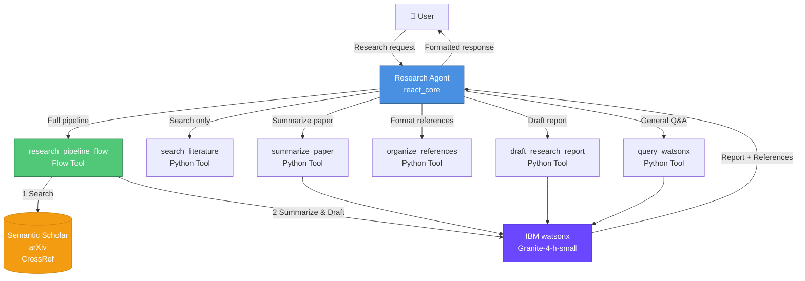
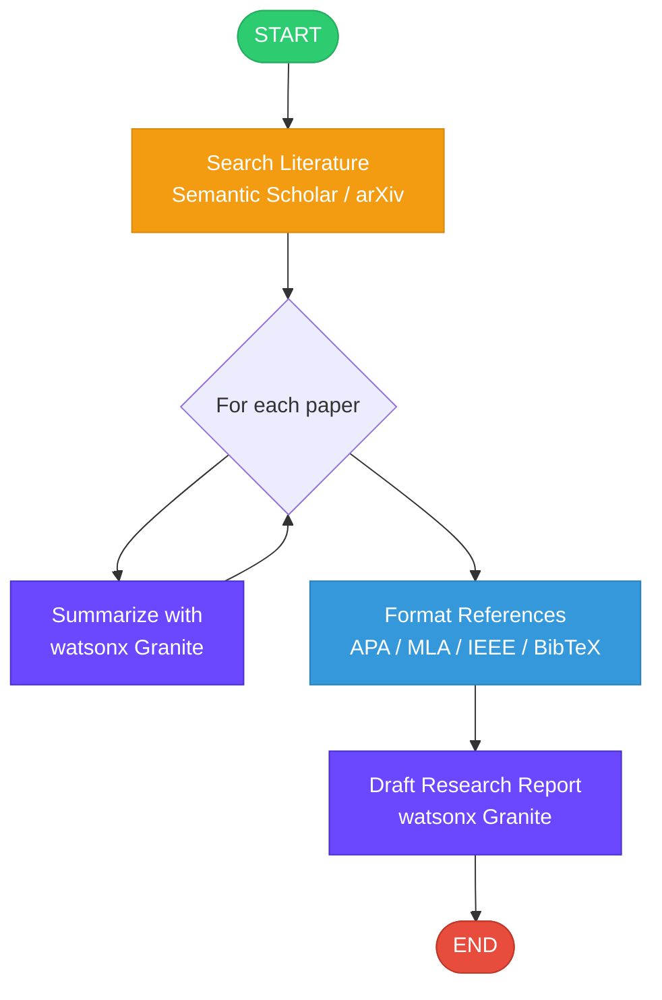

# Research Agent

An autonomous **academic and scientific R&D assistant** built on IBM watsonx Orchestrate, powered by **IBM watsonx Granite (`ibm/granite-4-h-small`)**.

The agent autonomously:
- 🔍 **Searches** academic literature (Semantic Scholar, arXiv, CrossRef)
- 📝 **Summarizes** papers into structured key-contribution breakdowns
- 📚 **Organizes** and formats bibliographic references (APA, MLA, IEEE, BibTeX)
- 📄 **Drafts** comprehensive research reports in Markdown

---

## Architecture Diagram



---

## Research Pipeline Flow



---

## Project Structure

```
research_agent/
├── __init__.py
├── import-all.sh               ← CLI import script
├── agents/
│   └── research_agent.yaml     ← Agent configuration
├── tools/
│   ├── __init__.py
│   ├── search_literature.py    ← Semantic Scholar / arXiv / CrossRef search
│   ├── summarize_paper.py      ← watsonx Granite paper summarizer
│   ├── organize_references.py  ← APA / MLA / IEEE / BibTeX formatter
│   ├── draft_report.py         ← watsonx Granite report drafter
│   ├── watsonx_llm.py          ← General watsonx Q&A tool
│   └── research_flow.py        ← End-to-end pipeline flow
└── generated/
    └── research_pipeline_flow.json

frontend/
├── index.html                  ← Single-page chat UI
└── ...

backend/
├── server.py                   ← FastAPI proxy to watsonx + agent
└── requirements.txt

main_flow.py                    ← Programmatic flow test runner
```

---

## Prerequisites

| Requirement | Details |
|---|---|
| IBM Cloud API Key | With access to watsonx.ai (`us-south`) |
| watsonx project ID | `cbf265ef-b635-441e-9fb3-600fe79d80af` |
| watsonx Orchestrate | ADK installed (`pip install ibm-watsonx-orchestrate`) |
| Python | 3.10+ |

---

## Setup & Import

### 1. Set environment variables

```bash
export WATSONX_API_KEY=<your-ibm-cloud-api-key>
```

### 2. Authenticate with watsonx Orchestrate

```bash
orchestrate env activate local   # or your target environment
```

### 3. Import all tools and the agent

```bash
chmod +x research_agent/import-all.sh
./research_agent/import-all.sh
```

### 4. Start the chat interface

```bash
orchestrate chat start
# Select: research_agent
```

---

## Running the Frontend

```bash
# Terminal 1 – Start backend
cd backend
pip install -r requirements.txt
WATSONX_API_KEY=<key> uvicorn server:app --reload --port 8000

# Terminal 2 – Open frontend
# Open frontend/index.html in your browser
# (or serve it: python -m http.server 3000 --directory frontend)
```

---

## Example Prompts

| Task | Example prompt |
|---|---|
| Full pipeline | `Research transformer architectures in NLP and write a report` |
| Search only | `Find the top 8 papers on protein folding published after 2021` |
| Summarize | `Summarize: "AlphaFold: A solution to a 50-year-old grand challenge in biology"` |
| Format refs | `Format these references in IEEE style` |
| Draft report | `Draft a 2000-word research report on federated learning` |
| Q&A | `What are the main challenges in explainable AI?` |

---

## Tools Reference

| Tool | Type | Description |
|---|---|---|
| `research_pipeline_flow` | Flow | Full end-to-end R&D pipeline |
| `search_literature` | Python | Search Semantic Scholar / arXiv / CrossRef |
| `summarize_paper` | Python | Structured paper summary via watsonx Granite |
| `organize_references` | Python | APA / MLA / IEEE / BibTeX formatter |
| `draft_research_report` | Python | Report drafter via watsonx Granite |
| `query_watsonx` | Python | General Q&A via watsonx Granite |

---

## Watsonx Configuration

| Parameter | Value |
|---|---|
| API URL | `https://us-south.ml.cloud.ibm.com/ml/v1/text/generation?version=2023-05-29` |
| Model | `ibm/granite-4-h-small` |
| Project ID | `cbf265ef-b635-441e-9fb3-600fe79d80af` |
